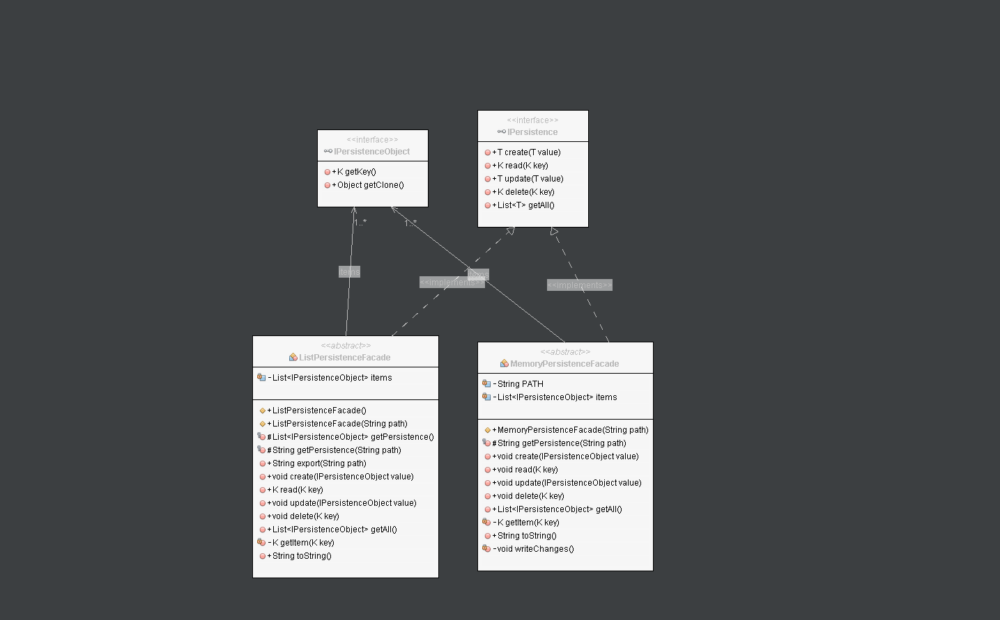

# Persistenza

## Persistenza generalizzata


### Interfaccia IPersistence<K, T>
```java
/**
 * Interfaccia che tutte le classi intente ad essere Peristenze devono implementare
 * @author herfost
 * @param <K> Datatype della chiave di accesso
 * @param <T> Datatype dei valori persistiti
 */
public interface IPersistence<K, T extends IPersistenceObject<K>> {
        public void create(T value) throws IllegalArgumentException;

    public T read(K key) throws IllegalArgumentException;

    public void update(T value) throws IllegalArgumentException;

    public void delete(K key) throws IllegalArgumentException;

    public List<T> getAll();
}
```

### Interfaccia IPersistenceObject<K>
```java
/**
 * Interfaccia di markup che identifica quali oggetti possono essere persistiti
 * @author herfost
 * @param <K> Datatype della chiave di accesso alla risorsa
 */
public interface IPersistenceObject<K> extends Serializable, Cloneable {
    public K getKey();
    public Object getClone();
}
```

### PeristenzaFacade
> Le classi implementano i metodi di gestione delle risorse e della persistenza tramite Containers (ArrayList, Map ecc.) o Memoria (File). 

1. [ListPersistenceFacade](/GenericPersistence/src/genericpersistence/persistence/ListPersistenceFacade.java)
2. [MemoryPersistenceFacade](/GenericPersistence/src/genericpersistence/persistence/MemoryPersistenceFacade.java)

## Persistenze Concrete
> Le persistence concrete sono classi che ereditano le proprietà delle [PersistenceFacade](/GenericPersistence/src/genericpersistence/persistence/) implementando nello specifico la persistenza per un oggetto concreto:

1. [BookPersistence](ConcretePersistences/src/concretepersistences/persistence/concrete/BookPersistence.java)
2. [BookPersistenceFile](ConcretePersistences/src/concretepersistences/persistence/concrete/BookPersistenceFile.java)

> sono persistenze concrete per gli oggetti di tipo:
- [Book](ConcretePersistences/src/concretepersistences/domain/Book.java)

### TODO
- Unit Testing
- Competizione Concorrente Semaforo / Mutex