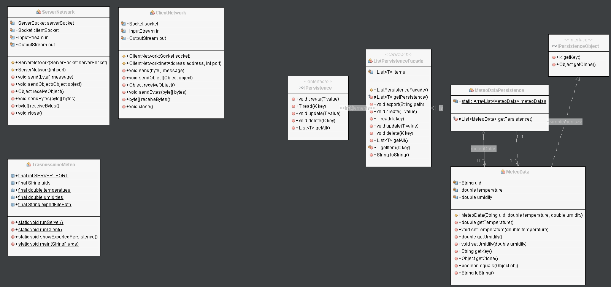

# Trasmissione Meteo

Realizzare una comunicazione client-server:

- Client invia rilevazioni meteo
- Server le va a persistere

---
## Trasmissione



## Domain

Il domain presenta la classe soggetta all'invio e la persistenza: [MeteoData](./src/trasmissionemeteo/domain/MeteoData.java)

```java
@Getter
@Setter
public class MeteoData implements IPersistenceObject<String> {

    private final String uid;
    private double temperature;
    private double umidity;

    public MeteoData(String uid, double temperature, double umidity) {
        this.uid = uid;
        this.temperature = temperature;
        this.umidity = umidity;
    }

    @Override
    public String getKey() {
        return uid;
    }

    @Override
    public Object getClone() {
        try {
            return super.clone();
        } catch (CloneNotSupportedException ex) {
            Logger.getLogger(MeteoData.class.getName()).log(Level.SEVERE, null, ex);
        }
        return null;
    }

    @Override
    public boolean equals(Object obj) {
        if (this == obj) {
            return true;
        }
        if (obj == null) {
            return false;
        }
        if (getClass() != obj.getClass()) {
            return false;
        }
        final MeteoData other = (MeteoData) obj;
        return Objects.equals(this.uid, other.uid);
    }

    @Override
    public String toString() {
        return "MeteoData {" + "uid=" + uid + ", temperature=" + temperature + ", umidity=" + umidity + " }";
    }
}
```

## Persistenza

Viene implementata una versione concreta della persistenza: [MeteoDataPersistence](./src/trasmissionemeteo/persistence/MeteoDataPersistence.java)

```java
public class MeteoDataPersistence extends ListPersistenceFacade<String, MeteoData> {

    private static ArrayList<MeteoData> meteoDatas;

    @Override
    protected List<MeteoData> getPersistence() {
        if (null == meteoDatas) {
            meteoDatas = new ArrayList<>();
        }

        return meteoDatas;
    }
}
```

## Network

I soggetti della comunciazione sono il [client](./src/trasmissionemeteo/network/ClientNetwork.java) ed il [server](./src/trasmissionemeteo/network/ServerNetwork.java):

```java
public class ClientNetwork {
    private Socket socket;
    private InputStream in;
    private OutputStream out;

    public ClientNetwork(Socket socket) throws IOException {
        this.socket = socket;
        in = socket.getInputStream();
        out = socket.getOutputStream();
    }

    public ClientNetwork(InetAddress address, int port) throws IOException {
        this(new Socket(address, port));
    }

    public void send(byte[] message) throws IOException {
        out.write(message);
    }

    public void sendObject(Object object) throws IOException {
        ObjectOutputStream objectOut = new ObjectOutputStream(out);
        objectOut.writeObject(object);
    }

    public Object receiveObject() throws IOException, ClassNotFoundException {
        ObjectInputStream objectIn = new ObjectInputStream(in);
        return objectIn.readObject();
    }

    public void sendBytes(byte[] bytes) throws IOException {
        out.write(bytes);
    }

    public byte[] receiveBytes() throws IOException {
        byte[] buffer = new byte[1024];
        int read = in.read(buffer);

        return ByteBuffer.wrap(buffer, 0, read).array();
    }

    public void close() throws IOException {
        in.close();
        out.close();
        socket.close();
        socket.close();
    }
```

```java
public class ServerNetwork {

    private ServerSocket serverSocket;
    private Socket clientSocket;
    private InputStream in;
    private OutputStream out;

    public ServerNetwork(ServerSocket serverSocket) throws IOException {
        this.serverSocket = serverSocket;
        clientSocket = serverSocket.accept();
        in = clientSocket.getInputStream();
        out = clientSocket.getOutputStream();
    }

    public ServerNetwork(int port) throws IOException {
        this(new ServerSocket(port));
    }

    public void send(byte[] message) throws IOException {
        out.write(message);
    }

    public void sendObject(Object object) throws IOException {
        ObjectOutputStream objectOut = new ObjectOutputStream(out);
        objectOut.writeObject(object);
    }

    public Object receiveObject() throws IOException, ClassNotFoundException {
        ObjectInputStream objectIn = new ObjectInputStream(in);
        return objectIn.readObject();
    }

    public void sendBytes(byte[] bytes) throws IOException {
        out.write(bytes);
    }

    public byte[] receiveBytes() throws IOException {
        byte[] buffer = new byte[1024];
        int read = in.read(buffer);

        return ByteBuffer.wrap(buffer, 0, read).array();
    }

    public void close() throws IOException {
        in.close();
        out.close();
        clientSocket.close();
        serverSocket.close();
    }
}
```

## Simulazione

Il server riceve gli oggetti da parte dei client e li va a persistere:

```java
public static void runServer() {
    MeteoDataPersistence persistence = new MeteoDataPersistence();

    ServerNetwork server = new ServerNetwork(SERVER_PORT);
    while (true) {
        MeteoData data = (MeteoData) server.receiveObject();
        persistence.create(data);
        System.out.println(persistence.read(data.getKey()));
        persistence.export(exportFilePath);
    }
}
```

Il client invia gli oggetti al server:

```java
public static void runClient() {
    ClientNetwork client = new ClientNetwork(InetAddress.getLocalHost(), SERVER_PORT);
    for (int i = 0; i < temperatues.length; ++i) {
        client.sendObject(new MeteoData(uids[i], temperatues[i], umidities[i]));
    }
}
```

Verifica dell'avvenuto salvataggio dei dati ricevuti:

```java
public static void showExportedPersistence() throws FileNotFoundException, IOException, ClassNotFoundException {
    ObjectInputStream in = new ObjectInputStream(new FileInputStream(exportFilePath));
    ArrayList<MeteoData> meteoDatas = (ArrayList<MeteoData>) in.readObject();
    meteoDatas.forEach((data) -> {
        System.out.println(data);
    });
}
```